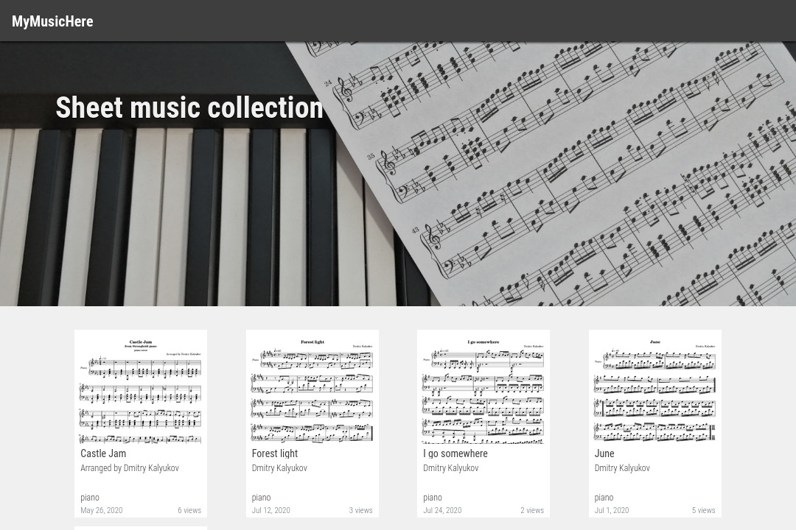

# MyMusicHere

[GitHub Actions]: https://github.com/dmitrvk/mymusichere/actions
[LilyPond]: http://lilypond.org
[mymusichere]: https://github.com/dmitrvk/mymusichere
[website]: https://www.mymusichere.me

The idea of MyMusicHere project is to automate the process
of publishing sheet music that was typeset with the [LilyPond] system.

The project includes two repositories.
This repository contains the source code of the [website].
The [mymusichere] repository contains the source code of sheet music.

Once uploaded to the master branch of [mymusichere] repository,
a source code in the LilyPond format is compiled with [GitHub Actions].
Resulting PDF files and PNG images are sent to the webserver
where the application publishes new scores on the [website].

Each score has a unique 'slug'.
This allows to create a simple and readable URL for each score, for example,
[https://www.mymusichere.me/june](https://www.mymusichere.me/june).

## To run locally

1. Create a Python 3.8 virtualenv

2. Install dependencies with `make install`

3. Install [LilyPond]

4. Provide the following environmental variables:

    | Variable             | Description                              |
    | :------------------- | :--------------------------------------- |
    | `BASE_DIR`           | `/absolute/path/to/project/root`         |
    | `PUBLISH_TOKEN`      | Secret token for publishing scores       |
    | `MYMUSICHERE_REMOTE` | `https://github.com/dmitrvk/mymusichere` |
    | `SECRET_KEY`         | Django's app secret key                  |

5. Create a superuser with `./manage.py createsuperuser`

6. Set up the database with `./manage.py migrate`

7. Compile CSS with `make css`

8. Collect static files with `make static`

9. Run dev server with `make run`

10. Publish sheet music with `./publish.py --force`

The website should be available at http://localhost:8000

## Editing CSS

*Sass* is used as a pre-processor for CSS.
To compile CSS from SCSS run `make css`.

When editing SCSS sources, it might be useful to run `make watch-scss`.
This enables auto-compilation every time SCSS is changed.

## Publishing sheet music

If you use LilyPond to create sheet music
and want to publish your scores on the [website],
please, visit the [mymusichere] repository
and create a pull request with your score.

## Licensing

This project is licensed under the
[MIT License](https://github.com/dmitrvk/mymusichere.me/blob/master/LICENSE).
